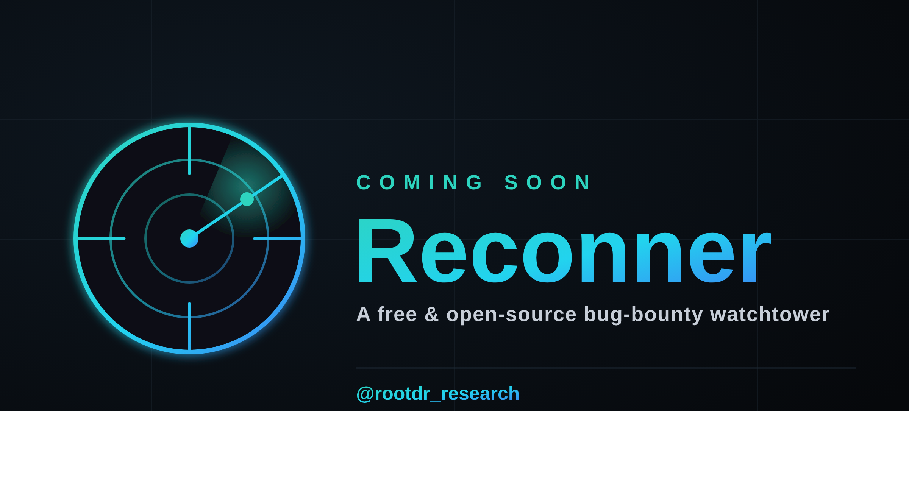
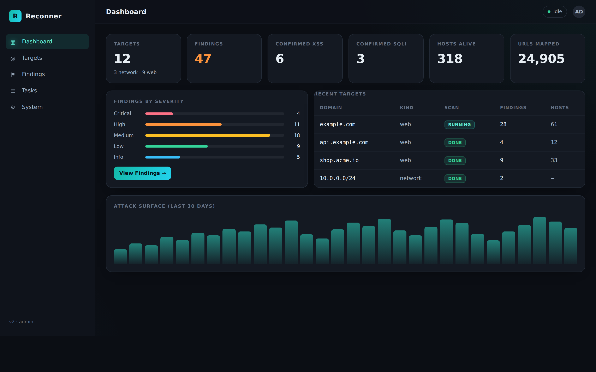
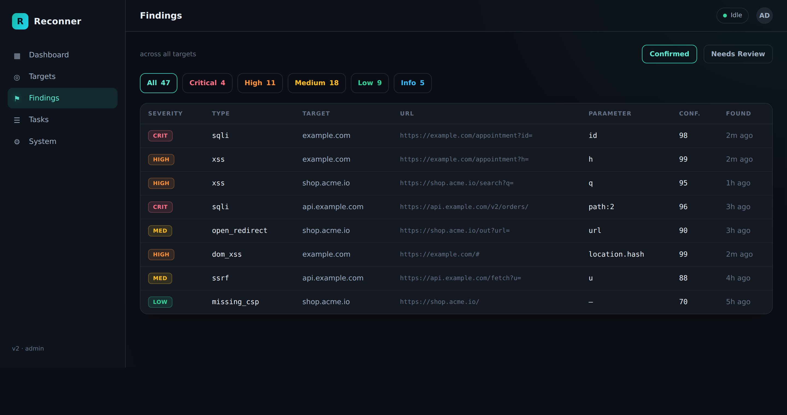
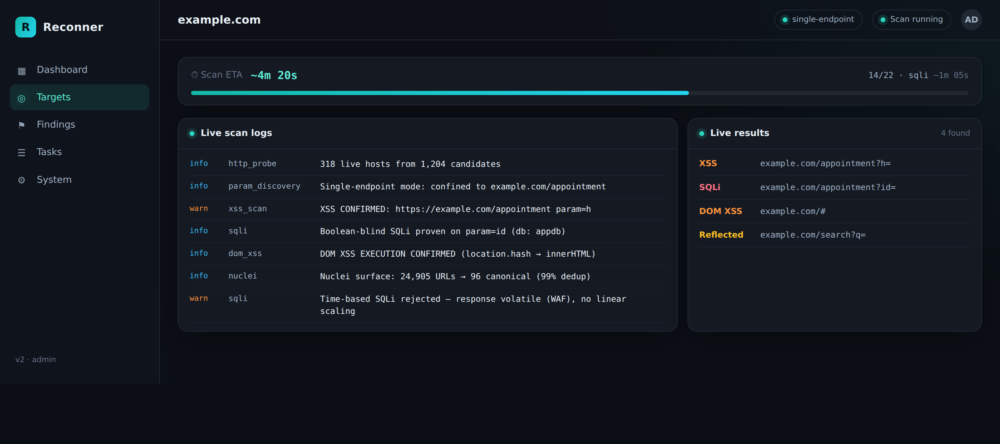
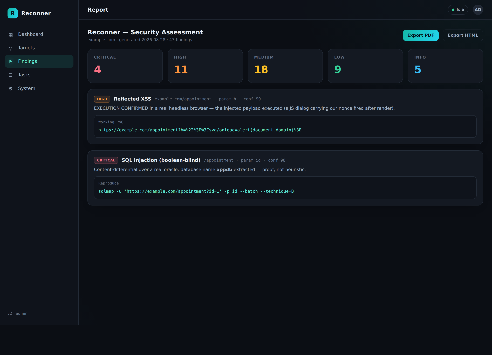

# Reconner

<p align="center">
  
</p>

<p align="center">
  <b>Self-hosted reconnaissance, DAST and continuous attack-surface monitoring for bug bounty and authorized security testing.</b>
</p>

Reconner turns a target into a dependency-aware security pipeline: discover the surface, expand it with URLs/parameters/JavaScript, run active checks, verify interesting results, and keep the target under continuous observation — from one dashboard.

> **Authorized testing only.** Run Reconner only against assets you own or are explicitly authorized to test.

---

## Pipeline

```text
Target
  │
  ▼
Scope / Asset discovery
  │
  ├── Subdomain enumeration
  ├── HTTP probing + fingerprinting
  └── Passive / external intelligence
  │
  ▼
Surface expansion
  │
  ├── JavaScript analysis
  ├── JS endpoint probing
  ├── Crawling
  ├── Wayback / historical URL mining
  ├── Parameter discovery
  ├── Reflected-parameter checks
  ├── Hidden parameter mining
  ├── Directory discovery
  └── Backup / exposed-file discovery
  │
  ▼
Security testing
  │
  ├── XSS / DAST
  ├── SQLi / NoSQLi
  ├── SSRF / OAST
  ├── IDOR / access control
  ├── JWT / OAuth
  ├── LFI / path traversal
  ├── SSTI / XXE / CMDi
  ├── Open Redirect
  ├── Cache poisoning
  ├── Race conditions*
  ├── Request smuggling*
  └── Nuclei
  │
  ▼
Verification
  │
  ├── Re-confirmation
  ├── Differential / behavioral checks
  ├── Browser execution where applicable
  ├── OAST correlation
  └── Confidence / priority scoring
  │
  ▼
Findings
  │
  ├── Evidence
  ├── Screenshots
  ├── Global findings
  └── Attack-path / correlation view
  │
  ▼
Monitoring
  └── Detect changes in HTTP services and JavaScript assets

* Optional / intrusive modules.
```

The scheduler can run independent modules in parallel while preserving module dependencies and resource limits.

---

## What Reconner Covers

### Web Recon

- Passive + active subdomain enumeration
- HTTP probing and service fingerprinting
- JavaScript analysis for endpoints, secrets and API keys
- JS endpoint probing
- Headless SPA crawling
- Historical URL discovery with Wayback
- Parameter discovery
- Reflected-parameter detection
- Hidden parameter mining
- Directory discovery
- Backup/configuration-file discovery
- Subdomain takeover detection
- Origin-IP discovery behind CDN/WAF using SecurityTrails
- Shodan passive intelligence
- Technology-specific intelligence

### Web Security Testing

Reconner's current scan modules cover:

- **XSS** — context-aware reflected XSS with browser-backed execution confirmation
- **DAST** — combined XSS/SQLi engine
- **SQL Injection** — error, boolean/content-differential and out-of-band checks
- **NoSQL Injection** — MongoDB operator/error-based checks
- **SSRF** — URL-parameter testing and blind/OAST verification
- **IDOR / Access Control** — requires two identities for meaningful cross-user verification
- **JWT / OAuth** — common JWT and OAuth flow weaknesses
- **LFI / Path Traversal**
- **SSTI** — common template-expression checks
- **XXE** — in-band and blind/OAST XML entity checks
- **Command Injection** — controlled marker/OAST-based verification
- **Open Redirect**
- **Web Cache Poisoning**
- **Race Conditions** — optional
- **Request Smuggling** — optional
- **CORS, CRLF and 403-bypass checks** through the vulnerability scanning layer
- **Account-takeover chain correlation** across relevant authentication findings
- **Exposure checks** including GraphQL introspection, API specifications and open buckets

### Nuclei

Nuclei is integrated as a separate detection layer and can consume the surfaces produced by Reconner.

The integration includes surface limiting, filtering and a verification stage for selected findings rather than treating every raw match as a confirmed vulnerability.

### OAST

Reconner supports out-of-band workflows for blind vulnerabilities, including:

- Blind SSRF
- Blind RCE
- Blind SQLi
- Blind SSTI
- Blind / stored XSS

An Interactsh-compatible server can be configured for OAST callbacks.

---

## Network Recon

Network targets can be supplied as:

```text
10.10.10.10
10.10.10.0/24
10.10.10.1-10.10.10.254
10.10.10.10,10.10.10.20
```

Network functionality includes:

- Port scanning
- Service/version detection
- Network vulnerability/CVE checks
- Unauthenticated/pre-auth service checks
- SSH / SMB / RDP / VNC credential testing
- Optional full-port scanning
- IP camera / DVR / NVR auditing through the Ingram integration
- Snapshot capture where supported

Credential testing and other intrusive network checks are intentionally gated and should only be enabled when allowed by the engagement.

---

## Single-Endpoint Mode

A URL containing a path or query can be scanned as an endpoint-focused target.

Example:

```text
https://target.example/orders/123?format=json
```

The scan can stay focused on that endpoint and its discovered paths instead of expanding to the entire host.

Path parameters are also considered:

```text
/orders/{id}
/users/{username}
/files/{filename}
```

This is particularly useful when investigating one API route or one suspicious application endpoint.

---

## Verification

Reconner has a dedicated verification stage instead of simply storing scanner output as confirmed findings.

Examples:

- Reflected XSS requires actual browser execution for confirmation.
- SQLi uses control/differential behavior and time-based evidence where applicable.
- OAST findings are correlated with callbacks.
- IDOR testing uses two identities when the module is enabled.
- Findings can be re-confirmed and assigned confidence/priority.

The result is a smaller set of findings that are more useful for manual validation and reporting.

---

## Dashboard

<p align="center">
  
  
</p>

<p align="center">
  
  
</p>

The dashboard provides:

- Target and asset management
- Scan profiles: **Quick / Standard / Deep / Custom**
- Per-module selection
- Live logs and scan progress
- ETA for running scans
- Findings and severity filtering
- Evidence and screenshots
- Global findings across targets
- Correlation / attack-path view
- System and scanner status
- Continuous change monitoring
- HTML / Markdown / PDF reports

---

## Installation

### Requirements

Native installation currently uses:

- Go **1.25+**
- Node.js **18+**
- A C compiler (`gcc`/build-essential) for CGO + SQLite
- Chromium/Chrome for browser-backed checks

The repository's Makefile builds the React dashboard first and then the Go backend.

### Linux / macOS

```bash
git clone https://github.com/rootdr-backup/Reconner.git
cd Reconner

make
```

Start the web application:

```bash
./reconner serve
```

By default the dashboard listens on:

```text
http://127.0.0.1:8080
```

The application itself does not require root for normal web reconnaissance.

For convenience, the repository also contains dependency installers:

```bash
# Linux
bash setup.sh

# macOS
bash scripts/reconner-macos-deps.sh
```

External recon tools are optional and are detected when available. The Docker image is the easiest way to get the bundled toolchain.

---

## Docker

For a server/VPS, Docker is the recommended deployment method.

```bash
git clone https://github.com/rootdr-backup/Reconner.git
cd Reconner

cp .env.example .env
docker compose up -d --build
```

Check startup:

```bash
docker compose logs -f
```

The dashboard is available on:

```text
http://127.0.0.1:8080
```

The container includes the application, built frontend, Reconner's Go-based toolchain, headless Chromium and nmap.

Data is persisted in the `reconner-data` named volume.

Useful commands:

```bash
docker compose ps
docker compose logs -f
docker compose down
docker compose up -d --build
```

To completely remove the persistent data volume:

```bash
docker compose down -v
```

### Server access

Reconner binds locally by default. For a remote VPS, the safest simple option is an SSH tunnel:

```bash
ssh -L 8080:127.0.0.1:8080 user@YOUR_SERVER
```

Then open:

```text
http://127.0.0.1:8080
```

If you intentionally expose the dashboard remotely, protect it with a firewall/VPN or a properly configured reverse proxy and TLS.

---

## Recommended Server

For a dedicated bug-bounty Reconner instance:

```text
8 vCPU
16 GB RAM
120 GB NVMe SSD
```

This is a practical starting point for continuous web recon, crawling, Nuclei, browser-backed checks and several concurrent targets.

For large programs or heavy CIDR/network scans:

```text
16+ vCPU
32+ GB RAM
250+ GB NVMe
```

Actual requirements depend on target size, concurrency, crawling depth, browser usage, Nuclei workload and network scanning.

Reconner exposes limits for concurrency, URLs, Nuclei surfaces/processes, rate limiting and other resource-heavy operations so the deployment can be tuned instead of simply increasing worker counts.

---

## Configuration

The native configuration is stored at:

```text
~/.recon-platform/config.json
```

Docker stores the configuration under the persistent `/data` volume.

Configuration covers scan/resource limits, HTTP throttling, Nuclei settings, browser settings, OAST, passive-intelligence providers and network modules.

Optional integrations include:

- SecurityTrails
- Shodan
- Censys
- FOFA
- 360 Quake
- ZoomEye
- VirusTotal
- Interactsh-compatible OAST
- Anthropic AI orchestration

Optional external services are only used by the corresponding enabled integration.

---

## External Toolchain

The Docker build includes the main reconnaissance toolchain used by Reconner, including:

```text
subfinder
httpx
nuclei
katana
naabu
dnsx
alterx
asnmap
uncover
gau
waybackurls
assetfinder
qsreplace
dalfox
subzy
nmap
Chromium
```

Other integrations can be installed separately when required.

---

## License

MIT License.

## Disclaimer

Reconner is intended for authorized security testing, bug bounty programs, penetration testing and research.

Do not scan or attack systems without explicit authorization. You are responsible for scope, rate limits, rules of engagement and compliance with applicable laws.

