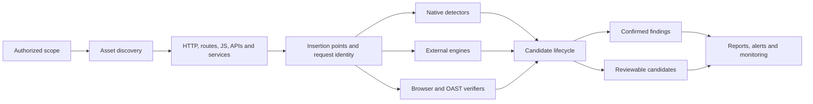

<p align="center">
  
</p>

<p align="center">
  <strong>Self-hosted attack-surface intelligence and verification-first DAST for authorized bug-bounty and security teams.</strong>
</p>

<p align="center">
  <a href="https://github.com/rootdr-backup/Reconner/actions/workflows/docker-image.yml"></a>
  <a href="https://github.com/rootdr-backup/Reconner/releases/latest"></a>
  <a href="https://github.com/rootdr-backup/Reconner/pkgs/container/reconner"></a>
  
  
  <a href="LICENSE"></a>
</p>

<p align="center">
  <a href="#quick-start">Quick start</a> ·
  <a href="#product-tour">Product tour</a> ·
  <a href="#how-verification-works">Verification model</a> ·
  <a href="docs/SCANNING_GUIDE.md">Scanning guide</a> ·
  <a href="docs/OPERATOR_GUIDE.md">Operator guide</a> ·
  <a href="docs/README.md">Documentation</a>
</p>

> [!IMPORTANT]
> Reconner performs active security testing. Run it only against assets you own
> or have explicit permission to test. The operator is responsible for scope,
> request limits, program rules, stop conditions, and collected evidence.

## What Reconner is

Reconner turns a declared scope into a durable map of assets, routes, parameters,
browser states, services, candidates, evidence, and verified findings. It keeps
discovery separate from proof, records work that could not be attempted, and
gives long-running scans real operational controls instead of treating tool
stdout as the finished product.

| Capability | What it provides |
|---|---|
| **Web attack surface** | DNS and HTTP discovery, crawling, JavaScript/API analysis, parameters, historical URLs, content and exposure checks |
| **Verification-first DAST** | Context-aware XSS, SQLi, access control, server-side classes, upload validation, Nuclei intake, and class-specific proof |
| **Explicit network pipeline** | Opt-in IP/CIDR/range scanning with port discovery, service/banner evidence, bounded OS detection, service-aware Nuclei, and optional auth checks |
| **Continuous operations** | Persistent tasks, phase ledger, pause/resume/skip/cancel, resource-aware scheduling, monitoring diffs, live logs, and Telegram controls |
| **Evidence and reporting** | Candidate lifecycle, reproducibility evidence, screenshots, reports, and portable target research bundles |
| **One self-hosted deployment** | Go service, responsive React dashboard, SQLite, Chromium, Nmap, and the pinned external toolchain in one multi-architecture image |

## Quick start

The recommended deployment needs only Docker and Docker Compose v2.

```bash
git clone https://github.com/rootdr-backup/Reconner.git
cd Reconner
cp .env.example .env
docker compose pull reconner
docker compose up -d reconner
docker compose ps
```

Open `http://<server-ip>:8080/`. If `ADMIN_PASSWORD` was left blank, retrieve
the generated first-run password with:

```bash
docker compose logs reconner | grep -A1 password
```

Verify the deployment:

```bash
curl -fsS http://127.0.0.1:8080/api/health
```

For a source build, replace the pull/start commands with:

```bash
docker compose up -d --build reconner
```

See the [operator guide](docs/OPERATOR_GUIDE.md) for safe upgrades, backups,
resource sizing, volume ownership recovery, and troubleshooting. The shorter
[Docker reference](README.Docker.md) documents the image and Compose layout.

## Product tour

### 1. Model the real scope

Create Projects manually or import public program scope from HackerOne,
Bugcrowd, Intigriti, or YesWeHack. Reconner preserves the asset type instead of
flattening everything into a hostname: domains, wildcards, exact pages,
JavaScript files, APIs, single IPs, CIDRs, and inclusive IP ranges each enter an
appropriate pipeline.

Scope changes remain operator-controlled. New upstream assets become pending
events, removed or submission-ineligible assets are suspended, and exact-page
or JavaScript seeds keep their path-level identity.

### 2. Choose a deliberate scan plan

Web scans expose safe, standard, and custom module selection plus slow, normal,
and fast request profiles. Network scans appear only for compatible assets and
offer Fast, Normal, and Deep profiles. Web and network phases cannot be mixed
accidentally in one task.

### 3. Watch coverage—not just progress

Every phase records discovered, eligible, attempted, candidate, confirmed,
rejected, blocked, and errored work. Missing credentials, tools, browser
capability, identities, callbacks, or eligible inputs do not become a false
“clean” result.

### 4. Triage evidence

Findings carry detector-specific evidence while uncertain signals remain
candidates. Admin and high-sensitive panels are content-grouped, redirect-aware,
and deduplicated across hosts. The orange target count is reserved for
actionable medium-or-higher findings instead of low-value inventory noise.

### 5. Keep the operation moving

Use pause, resume, cancel, or **Skip phase** from the dashboard or Telegram.
Browser-backed phases receive bounded cleanup and task-owned Chromium process
termination, so a stuck verifier cannot hold a scheduler slot forever.

## Pipeline


```mermaid
flowchart LR
    A[Authorized scope] --> B[Asset discovery]
    B --> C[HTTP, routes, JS, APIs and services]
    C --> D[Insertion points and request identity]
    D --> E[Native detectors]
    D --> F[External engines]
    D --> G[Browser and OAST verifiers]
    E --> H[Candidate lifecycle]
    F --> H
    G --> H
    H --> I[Confirmed findings]
    H --> J[Reviewable candidates]
    I --> K[Reports, alerts and monitoring]
    J --> K
```

Independent phases can run in parallel, but expensive detector families share
per-target and per-host gates. This keeps throughput across targets without
silently multiplying pressure against one application.

## How verification works

Reconner does not promote a finding merely because a URL returned `200`, a
string was reflected, a timer moved once, or a third-party tool emitted a line.

| State | Meaning |
|---|---|
| **Observation** | Discovery data tied to an asset, request, response, script, route, browser state, or service |
| **Candidate** | A signal worth review or independent verification, but not yet proven |
| **Confirmed** | The detector's class-specific replay or proof contract succeeded |
| **Rejected** | A negative control, encoding, soft-404 family, unstable timing, or replay disproved the signal |
| **Blocked / unsupported** | The phase could not make a valid attempt and records why |

Examples include a fresh nonce executing in Chromium for XSS, multi-signal
boolean/error/timing evidence for SQLi, token-attributed callbacks for blind
classes, stable denied controls plus successful replays for access-control
bypasses, and independent retrieval or processing proof for dangerous uploads.

The deterministic local corpus is expected to remain clean for its named
positive and negative fixtures. That is a regression contract, not a promise of
zero false positives or false negatives on arbitrary applications. See the
[capability matrix](docs/V3_CAPABILITY_MATRIX.md) and
[quality evidence](docs/QUALITY_EVIDENCE_REVIEW.md).

## Web coverage

- subdomain, DNS, CNAME, wildcard, vhost, HTTP, archive, crawler, and rendered
  browser discovery;
- recursive JavaScript dependencies, source maps, endpoints, API schemas,
  GraphQL, forms, query/path/header/cookie/JSON/XML insertion points;
- cross-asset API data-exposure workflows that correlate high-signal JavaScript
  parameters, negotiate advertised read methods/content types, and retain only
  replay-stable redacted schema evidence;
- directory, backup/config exposure, takeover, broken-link, origin, and admin
  panel intelligence;
- reflected and DOM XSS with context selection and browser execution proof;
- error, boolean, timing, and second-order SQLi with optional sqlmap confirmation;
- SSRF/OAST, LFI, SSTI, CSTI, command injection, XXE, NoSQLi, and open redirects;
- IDOR/authz, CSRF, CORS, JWT, account takeover, cache, request-smuggling, and
  race-condition workflows;
- structured file-upload validation and proof-gated Nuclei intake.

Reconner's general XSS pipeline covers reflected and DOM XSS. Stored upload or
processing behaviors are handled by their dedicated module rather than by
blindly spraying the general XSS corpus.

## Network coverage

Network scanning is opt-in for a single IP, CIDR, or inclusive IP range such as
`192.168.1.1-192.168.1.10`.

| Profile | Discovery | Optional validation |
|---|---|---|
| **Fast** | Curated high-signal ports | Port, banner, service, and bounded OS evidence |
| **Normal** | Top 1,000 TCP ports | Service-aware network Nuclei and proof-gated 401/403 checks |
| **Deep** | All TCP ports | Normal checks plus an explicit, paced HTTP Basic credential audit |

Naabu uses TCP connect discovery; ICMP is informational and never a liveness
gate. Nmap fingerprints verified open ports. Recognized CDN/WAF edges and
configured exclusions are removed before probing. Credential checks require a
real Basic challenge, stop on lockout/rate-limit responses, and promote only
stable replay evidence.

Read the [scanning guide](docs/SCANNING_GUIDE.md) before running broad scopes.

## Operator controls

### Custom corpora

**System & updates → Wordlists & payloads** manages additions for subdomains,
virtual hosts, directories, backups, exposures, extensions, parameters, JWT,
XSS, SQLi, LFI, SSRF, SSTI, CSTI, NoSQLi, command injection, redirects, and
network auth. Imports normalize category syntax, deduplicate compiled and custom
entries, and report input, added, duplicate, and invalid counts. Restore removes
only the custom layer and returns that category to compiled defaults.

Custom payloads extend coverage but cannot bypass a detector's proof contract.

### Target research bundles

From a target page, use **Report → Download scan bundle — ZIP**. The bundle
contains a versioned manifest, structured discovery/finding/evidence data,
phase and task state, stored screenshots, browser-state coverage, and bounded
in-scope JavaScript/chunk snapshots. Redirects are scope-checked and individual
fetch failures remain visible in the manifest.

### Telegram control bot

Connect a BotFather bot under **System → Integrations → Telegram**. One bot can
allowlist multiple chats with viewer, operator, or admin roles. It supports scan
and finding alerts plus target and task controls, including Skip phase. Delivery
uses a durable, per-chat outbox with retry and deduplication; no public webhook
is required.

Commands include `/status`, `/targets`, `/target`, `/scans`, `/findings`,
`/scan`, `/pause`, `/resume`, `/skip`, `/cancel`, `/addtarget`, `/edittarget`,
and `/deletetarget`.

## v3.4 highlights

- explicit Fast, Normal, and Deep network pipelines for IP/CIDR/range assets;
- proof-gated file-upload validation across multipart and structured API shapes;
- browser-state coverage for frames, shadow roots, forms, tabs, hashes, and
  disclosure controls;
- deeper HTML/SVG/attribute/JavaScript/URL/`srcdoc` XSS context handling;
- verified and content-grouped admin/high-sensitive panel inventory;
- per-phase measurable coverage counters and richer portable exports;
- stricter Nuclei signal filtering and format-specific exposure templates.

The full technical change record is in the
[v3.4.0 release notes](docs/V3_4_0_RELEASE_NOTES.md).

## Toolchain

The official image pins and executes every required command during its build.

| Area | Bundled tools |
|---|---|
| Discovery | subfinder, assetfinder, findomain, alterx, asnmap, scilla, naabu |
| DNS | dnsx, massdns, puredns, shuffledns |
| HTTP and crawling | httpx, katana, hakrawler, gau, waybackurls, waymore, uro |
| Content | dirsearch, feroxbuster |
| Verification | nuclei, subzy, sqlmap, nmap, Chromium |
| Runtime | Go service, SQLite, Python 3, git, tini |

The application runs as uid/gid `10001`. Compose keeps `NET_RAW` and
`NET_ADMIN` only so the file-capability-scoped Nmap binary can perform bounded
OS fingerprinting. Removing those capabilities disables OS detection while
retaining TCP-connect port and service discovery.

## Configuration

Bootstrap values live in `.env`:

| Variable | Purpose | Default |
|---|---|---|
| `HOST_PORT` | Dashboard port on the Docker host | `8080` |
| `ADMIN_USER` | Initial administrator username | `admin` |
| `ADMIN_PASSWORD` | Initial password; blank generates a random value | blank |
| `RECON_MEMORY_LIMIT` | Whole-container memory limit | `3g` |
| `RECON_PIDS_LIMIT` | Whole-container process limit | `512` |

Persistent settings live in `/data/config.json` and are managed primarily from
the dashboard. Targets, findings, users, screenshots, corpora, templates, and
configuration live in the `reconner-data` volume.

Never commit `.env` or a populated configuration file. Deployment- or
project-level identifying headers can be configured for programs that require
them; project values override global defaults and are sent only to admitted
project hosts.

## Documentation

| Start here | Purpose |
|---|---|
| [Documentation hub](docs/README.md) | All operator, scanning, architecture, evidence, and release documents |
| [Operator guide](docs/OPERATOR_GUIDE.md) | Install, update, back up, size, recover, and troubleshoot a deployment |
| [Scanning guide](docs/SCANNING_GUIDE.md) | Scope types, web/network plans, proof states, controls, corpora, and exports |
| [Capability matrix](docs/V3_CAPABILITY_MATRIX.md) | Module prerequisites, positive-proof contracts, and supported boundaries |
| [Docker reference](README.Docker.md) | Image contents, Compose layout, capabilities, and persistence |
| [v3.4.0 release notes](docs/V3_4_0_RELEASE_NOTES.md) | Current release details and local regression commands |
| [Contributing](CONTRIBUTING.md) | Development workflow and contribution expectations |
| [Security policy](SECURITY.md) | Private vulnerability reporting for Reconner itself |

## Development

Direct development requires Go, Node.js/npm, a C compiler for SQLite, and the
external tools needed by the modules you run locally.

```bash
make frontend
make backend
go test ./...
go vet ./...
```

Frontend-only workflow:

```bash
cd frontend
npm ci
npm run dev
npm run build
```

Release tags must match `VERSION`. CI verifies formatting, dependencies, unit
and race tests, deterministic detector fixtures, migrations, frontend and
browser workflows, release smoke tests, secret/source/dependency scans, and
native `linux/amd64` plus `linux/arm64` container builds before publication.

## Data safety

Normal image and source updates keep the named volume. This command does not:

```bash
docker compose down -v
```

The `-v` flag deletes the persistent volume and therefore the database,
configuration, users, targets, findings, corpora, templates, and stored
artifacts. Do not use it for a normal upgrade.

## Responsible use

Reconner is intended for authorized security research, bug-bounty programs,
and defensive assessment. Respect official scope, exclusions, rate limits,
privacy requirements, and rules of engagement. Public program catalogs are a
convenience cache—not legal authorization. The maintainers are not responsible
for unauthorized use or resulting damage.

## Support

For a false positive, missed fixture, operational bug, or UI issue, open a
[GitHub issue](https://github.com/rootdr-backup/Reconner/issues) with a minimal
reproduction and sanitized logs. Private vulnerabilities in Reconner itself
belong in the process described by [SECURITY.md](SECURITY.md).

Community contact: [@rootdr_research](https://t.me/rootdr_research)

If Reconner saves you time:

- Iranian gateway: [daramet.com/RootDR](https://daramet.com/RootDR)
- Solana: `BBdEFMnnMFX8ZqeoXbnmYYLE49gNEygdUDy4ctuB9EiT`
- Bitcoin: `bc1qefw45vhpwy6k0hw4gayu9qmrje9ml34l8ap7ly`
- EVM: `0x58e7c01913D6eA354DEaB1f83AD9A95B4D9EAfCa`
- Tron: `TYE2DKJZ7nNkBNEJ7uSr374ZVfKfBUYTic`

---

<p align="center">
  Built by <strong>RootDR</strong> for the bug-bounty community.
</p>
